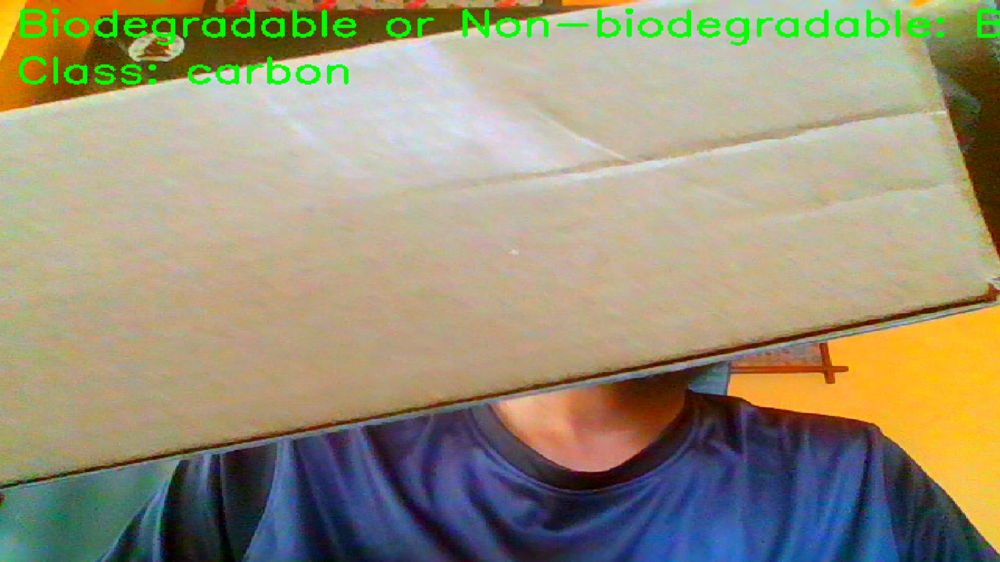

## 1. **Gemini’s Vision Transformer (ViT) Foundation**

- Gemini is not just another AI model—it is a multimodal powerhouse built on the Transformer paradigm, leveraging the **Vision Transformer (ViT)** at its visual core.

- **Vision Encoder:** Technical deep-dives and Google’s own documentation confirm Gemini employs a ViT-style encoder for images. This means images are processed not with old-school CNNs, but with a transformer that sees the *big picture*—literally!
- **Multimodal Integration:** Gemini natively fuses text, images, audio, and video via cross-modal attention layers, enabling it to understand and reason across all forms of data.

> **There are four input modalities, text (encoded with Sentencepiece), images (ViT), video (multiple image frames), and audio (Universal Speech Model features @16kHz).**  

---

## 2. **Gemini’s ViT Approach**

### 🌟 **A. State-of-the-Art Multimodal Performance**
- **Benchmark Leader:** Gemini outshines models like GPT-4V and GPT-4 Turbo on image, video, and audio tasks, thanks to its ViT-based encoder and cross-modal transformer backbone.
- **Contextual Visual Reasoning:** ViT lets Gemini “see” context, spatial relationships, and subtle cues—making it a visual reasoning champ.

### ⚡ **B. Scalability & Efficiency**
- **Massive Context Window:** Gemini processes up to **10 million tokens**—integrating vision and language over long contexts, unlike CNN-based models.
- **Efficient MoE Design:** Mixture-of-Experts (MoE) architecture means only relevant model pathways activate, boosting efficiency and scalability.

### 🌍 **C. Real-World Generalization**
- **General-Purpose Multimodality:** Gemini’s ViT-based design generalizes to new domains (robotics, code, media) without retraining.
- **Agentic Abilities:** Supports real-time tool use and proactive decision-making via deep ViT integration.

---

## 3. **Gemini (ViT) vs. Other Approaches: At-a-Glance**

| Feature                        | Gemini (ViT-based)      | CNN-based Models      | Hybrid/Non-ViT LLMs      |
|-------------------------------|-------------------------|----------------------|--------------------------|
| Visual Encoder                | Vision Transformer (ViT)| CNN                  | CNN or hybrid            |
| Multimodal Fusion             | Native cross-modal attn.| Late fusion          | Limited or late fusion   |
| Context Window                | Up to 10M tokens        | Short                | Short to moderate        |
| Visual Reasoning              | High (contextual, spatial)| Object-level only  | Moderate                 |
| Generalization                | Strong (zero-shot, few-shot)| Weak             | Moderate                 |
| Efficiency (MoE, scaling)     | High                    | Low                  | Moderate                 |
| Real-world Adaptability       | Excellent               | Poor                 | Moderate                 |
| Benchmarks (Image/Video/Audio)| SOTA or better          | Lagging              | Competitive but limited  |

---

## 4. **Real-World Proof: Code Workflow Using Gemini’s ViT**

# ♻️ Real-Time Waste Classification with Gemini ViT: Fullscreen Webcam Demo

This code brings together the **power of Gemini’s Vision Transformer (ViT)** and your webcam, delivering real-time, expert waste classification—right on your screen. It leverages Gemini’s multimodal capabilities (as proven above) to analyze each video frame, classify waste, and overlay the results in a fullscreen window.

---

## 🚦 How It Works

- **OpenCV** captures frames from your webcam.
- Each frame is converted to a PIL Image and sent to Gemini’s `gemini-2.0-flash` model.
- Gemini uses its ViT-based encoder to analyze the image and returns a detailed classification (biodegradable/non-biodegradable + class).
- The result is overlaid on the video feed in real time, in fullscreen mode.

---

## 🌟 Why This Is Awesome

- **Live Multimodal Reasoning:** Each frame is analyzed by Gemini’s ViT, fusing visual and textual understanding for expert-level classification.
- **Real-World Proof:** You’re seeing Gemini’s ViT backbone in action—processing, reasoning, and adapting in real time.
- **Scalable & Adaptable:** This workflow can be extended to other classification tasks, object detection, or even robotics—showcasing why Gemini’s ViT-based multimodal architecture is a game-changer.

> **This isn’t just a webcam demo—it’s a live showcase of state-of-the-art AI vision, powered by Gemini’s Vision Transformer!**

---

## Output

---

